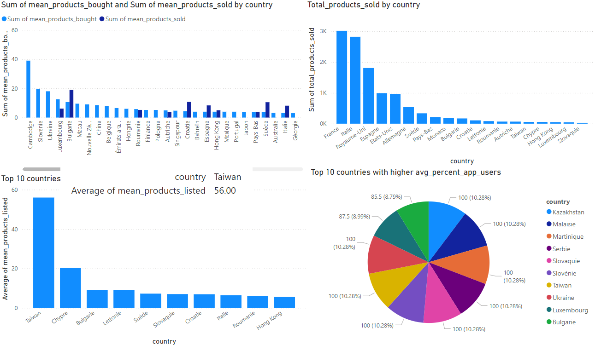

# **E-commerce Data Pipeline Using Databricks and Azure**

## **Project Overview**
This project focuses on building a scalable and efficient data pipeline for an e-commerce platform using **Azure Databricks**. The objective is to transform raw data into a single, consolidated table for analytics and visualization, enabling actionable insights into user behavior, activity trends, and engagement metrics. By leveraging the **Medallion Architecture** (Bronze, Silver, Gold layers), this pipeline ensures data quality, traceability, and high performance for decision-making.

---

## **Workflow**

Below is the workflow for the data pipeline architecture. It follows the **Medallion Architecture**, transforming raw data into analytics-ready insights step by step.


## **Data Description**
The dataset provides insights into user behavior on a successful C2C e-commerce fashion platform with over 9 million registered users since its launch in Europe in 2009. Registered users act as both sellers and buyers, offering a unique perspective on engagement, activity, and social network interactions. The data serves as a benchmark for understanding retention, international adoption, and the performance of social features in e-commerce.

---


### **Data Ingestion**

The data ingestion process involves handling and processing large datasets using a scalable and efficient pipeline:

1. **Raw Data Handling**:
   - The user dataset, which is massive, is divided into smaller chunks using Python to improve manageability and scalability.

2. **Azure Data Factory Pipelines**:
   - **Pipeline 1**:
     - Ingests user data chunks into **Azure Data Lake Storage**, converting them from CSV to Parquet format for optimized storage and querying.
     - Stores the Parquet files in **Landing-Zone-1**.
   - **Pipeline 2**:
     - Ingests additional datasets, such as sellers, buyers, and countries, ensuring all data aligns for downstream processing.

3. **Optimized Storage**:
   - Parquet format is used across all datasets for efficient storage and faster querying during the transformation phase.

The workflow for data ingestion is illustrated below:


### **Data Transformation**

The data transformation process leverages the **Medallion Architecture**, which consists of three layers to ensure data quality, traceability, and analytics-readiness:

1. **Bronze Layer**:
   - Raw Parquet files are ingested into **Delta Lake** without modification.
   - This layer preserves the original schema and format to maintain data traceability and reproducibility.

2. **Silver Layer**:
   - The data is cleaned, structured, and enhanced:
     - Handles null values and standardizes data types.
     - Standardizes column names for consistency across datasets.
     - Computes key metrics like `mean_products_listed`, `total_products_sold`, and average user activity.
   - Example PySpark Transformation:
     ```python
     from pyspark.sql.functions import col, avg, count

     silver_df = bronze_df.groupBy("country").agg(
         avg(col("products_listed")).alias("avg_products_listed"),
         count("user_id").alias("user_count")
     )
     silver_df.write.format("delta").save("/mnt/silver-layer")
     ```

3. **Gold Layer**:
   - The data is refined and aggregated into a single table optimized for analytics and visualization.
   - Key metrics include:
     - Total products sold by country.
     - Average products listed and sold by users.
   - Example PySpark Transformation:
     ```python
     gold_df = silver_df.withColumn(
         "total_products_sold", col("products_sold") * col("user_count")
     )
     gold_df.write.format("delta").save("/mnt/gold-layer")
     ```
This structured approach ensures the pipeline produces high-quality data for downstream analytics and visualization.


### **Data Visualization**



- **Sum of Mean Products Bought and Sold by Country**:
  - Cambodia and Slovenia show the highest combined levels of buying and selling activity, highlighting them as key markets for user engagement.

- **Total Products Sold by Country**:
  - France, Italy, and the United Kingdom are the top contributors to total product sales, emphasizing their strategic importance for platform performance, followed by the United States and Germany.

- **Top 10 Countries by Average of Mean Products Listed**:
  - Taiwan leads with the highest average of products listed, followed by Cyprus and Bulgaria, indicating strong seller engagement in these regions.

- **Top 10 Countries with Higher Average Percentage of App Users**:
  - Kazakhstan, Malaysia, and Martinique have the highest app user percentages, showcasing strong mobile adoption and engagement across diverse markets.


## **Technologies Used**
- **Azure Databricks**: For scalable data processing and transformation using PySpark.
- **Azure Data Factory**: For orchestrating pipelines to ingest data into Azure Data Lake Storage.
- **Azure Data Lake Storage**: For storing raw, intermediate, and processed data.
- **Delta Lake**: For optimized storage and querying.
- **Power BI**: For creating interactive dashboards and visualizations.

---

