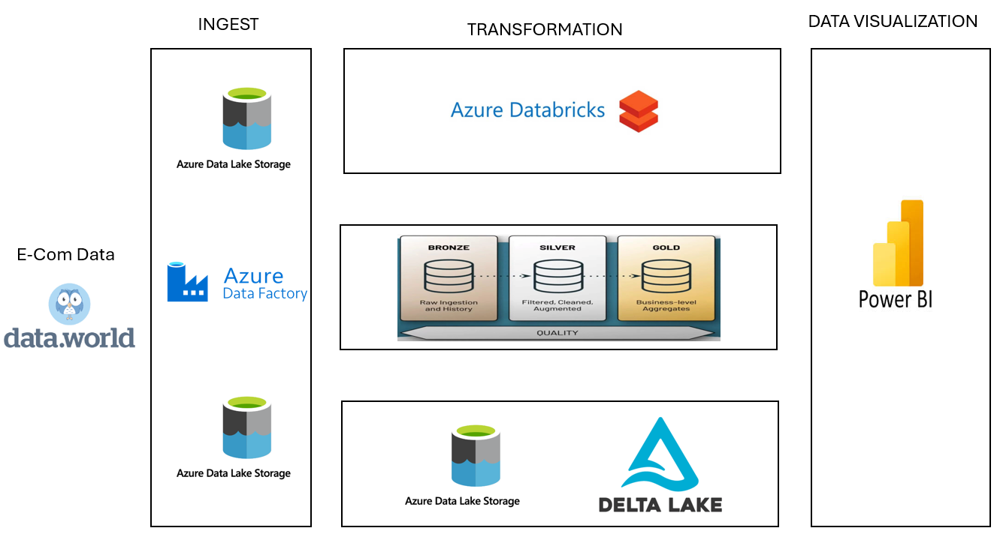
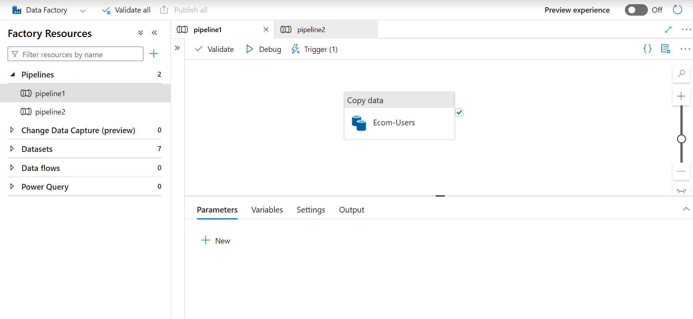
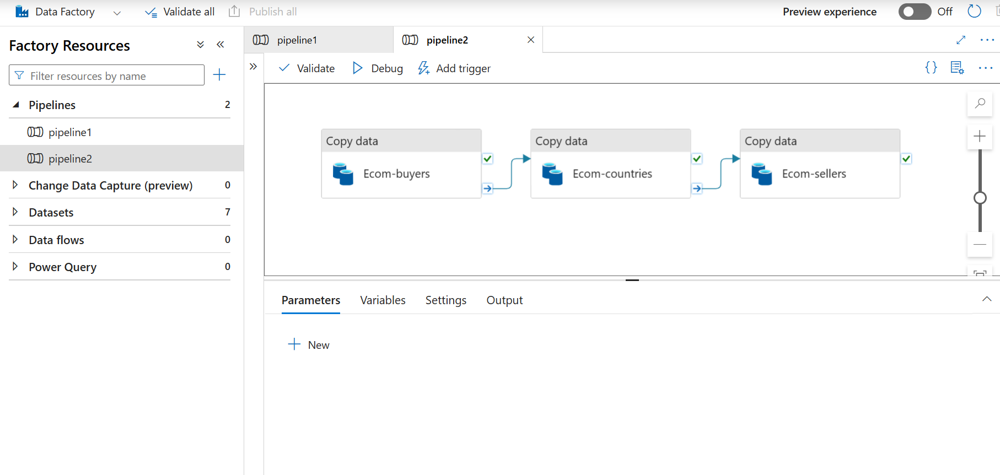

# **E-commerce Data Pipeline Using Databricks and Azure**

## **Project Overview**
This project focuses on building a scalable and efficient data pipeline for an e-commerce platform using **Azure Databricks**. The objective is to transform raw data into a single, consolidated table for analytics and visualization, enabling actionable insights into user behavior, activity trends, and engagement metrics. By leveraging the **Medallion Architecture** (Bronze, Silver, Gold layers), this pipeline ensures data quality, traceability, and high performance for decision-making.

---

## **Workflow**

Below is the workflow for the data pipeline architecture. It follows the **Medallion Architecture**, transforming raw data into analytics-ready insights step by step.



### **Detailed Workflow Explanation**
1. **Data Ingestion**:
   - **Raw Data**: The user dataset, which is large, is broken into smaller chunks using Python for better handling.
   - **Azure Data Factory Pipelines**:
     - A pipeline is built to ingest the user data chunks into **Azure Data Lake Storage**, converting them from CSV to Parquet and storing them in **Landing-Zone-1**.
     - Another pipeline is created for ingesting related datasets, such as sellers, buyers, and countries, ensuring all data aligns for downstream processing.





2. **Data Transformation**:
   - **Bronze Layer**: Raw Parquet files are ingested into Delta Lake without modification, maintaining data traceability.
   - **Silver Layer**: Data cleaning and transformation are performed:
     - Missing values are handled.
     - Column names are standardized.
     - Aggregations are applied to compute metrics like average user activity, products listed, and sold.
   - **Gold Layer**: Refined data is aggregated into a single table optimized for analytics and visualization.

3. **Data Visualization**:
   - The processed data is loaded into Power BI to create interactive dashboards that highlight key metrics such as:
     - Average products listed and sold by country.
     - Total sellers by region.
     - Engagement trends.

---

## **Data Description**
The dataset provides insights into user behavior on a successful C2C e-commerce fashion platform with over 9 million registered users since its launch in Europe in 2009. Registered users act as both sellers and buyers, offering a unique perspective on engagement, activity, and social network interactions. The data serves as a benchmark for understanding retention, international adoption, and the performance of social features in e-commerce.

---

## **Key Features**

### **1. Data Ingestion**
- The data ingestion process includes:
  - Breaking down large datasets into manageable chunks using Python.
  - Using Azure Data Factory pipelines to load these chunks into Azure Data Lake Storage.
  - Converting data from CSV to Parquet format for faster querying and storage optimization.
  - Ingesting related datasets for sellers, buyers, and countries to ensure proper relationships between data.

### **2. Data Transformation**
Using the **Medallion Architecture**, the transformation involves three layers:
- **Bronze Layer**:
  - Raw data is ingested into Delta Lake, preserving the original schema and format for traceability.
- **Silver Layer**:
  - Data is cleaned, structured, and enhanced:
    - Null values are handled, and data types are standardized.
    - Key metrics like `mean_products_listed` and `total_products_sold` are calculated.
  - Example PySpark Transformation:
    ```python
    from pyspark.sql.functions import col, avg, count

    silver_df = bronze_df.groupBy("country").agg(
        avg(col("products_listed")).alias("avg_products_listed"),
        count("user_id").alias("user_count")
    )
    silver_df.write.format("delta").save("/mnt/silver-layer")
    ```
- **Gold Layer**:
  - Refined data is aggregated into a single table optimized for visualization and analytics.
  - Key metrics include:
    - Total products sold by country.
    - Average products listed by country.
  - Example PySpark Transformation:
    ```python
    gold_df = silver_df.withColumn(
        "total_products_sold", col("products_sold") * col("user_count")
    )
    gold_df.write.format("delta").save("/mnt/gold-layer")
    ```

### **3. Data Visualization**
- Power BI dashboards provide actionable insights, showcasing key metrics through:
  - **Bar Charts**: Average products listed by country.
  - **Pie Charts**: Distribution of sellers across countries.
  - **Column Charts**: Total products sold by region.
  - **Line Charts**: Comparative trends in products listed and sold.

---

## **Technologies Used**
- **Azure Databricks**: For scalable data processing and transformation using PySpark.
- **Azure Data Factory**: For orchestrating pipelines to ingest data into Azure Data Lake Storage.
- **Azure Data Lake Storage**: For storing raw, intermediate, and processed data.
- **Delta Lake**: For optimized storage and querying.
- **Power BI**: For creating interactive dashboards and visualizations.

---

